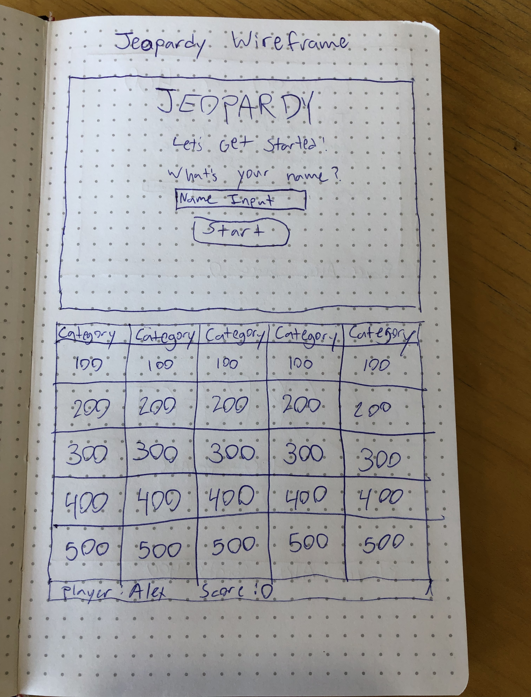
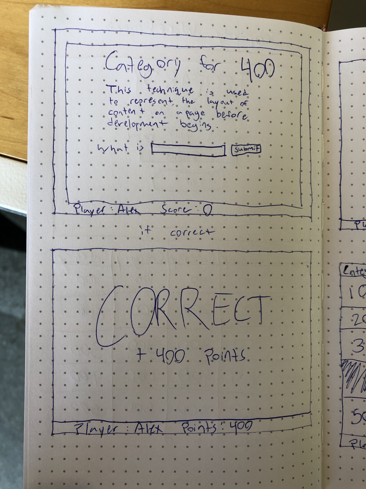
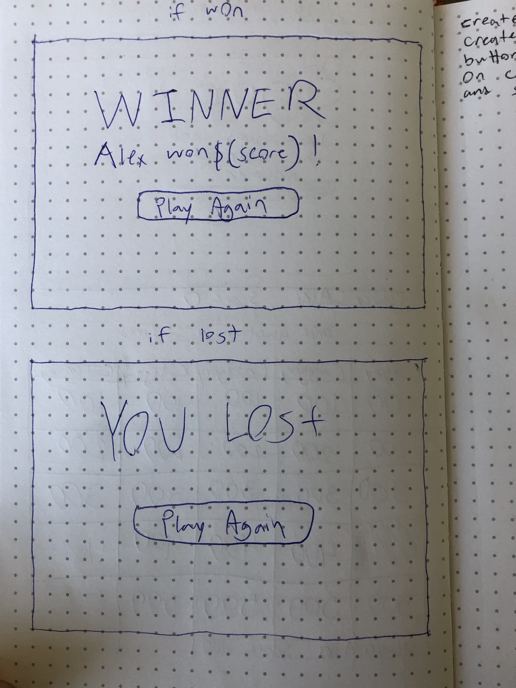

# jeopardy-game
(https://trello.com/b/iFnJJ7xf/sei-project-1 "My Trello Project Board")

(http://alex-pitsikoulis-jeopardy-game.netlify.com/ "My Deployed Game")

###### Citation:
###### function shuffle():
(https://stackoverflow.com/questions/2450954/how-to-randomize-shuffle-a-javascript-array "Stack Overflow thread where I found the function.)